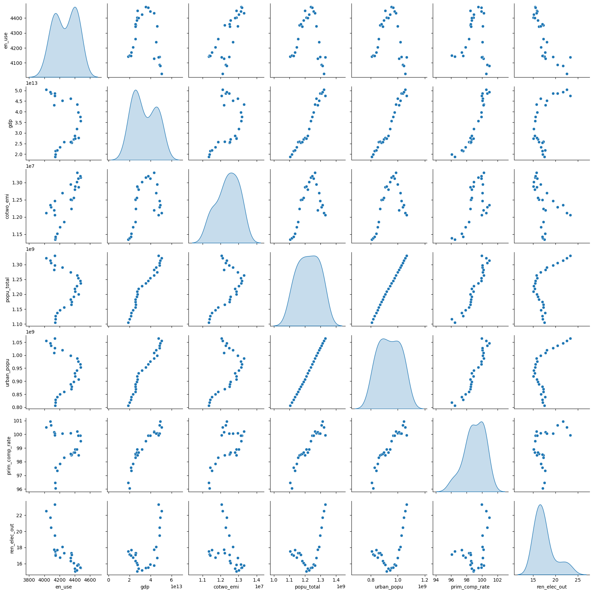

# Q1 Data Acquisition and Preprocessing

## 1. Introduction
The data acquisition process for CO2 emissions data, along with other environmental and socio-economic indicators from the World Bank Database, involved the development of several classes and methods to facilitate API calls to the World Bank and the subsequent data cleaning and preprocessing of the obtained files.

## 2. Data Acquisition
### 2.1 Data Source
- **Source:** [World Bank Database](https://data.worldbank.org/)
- **Access Method:** World Bank API and manual downloads
- **Date Range:** 1960 - 2023
- **Indicators Downloaded:** 
  - CO2 emissions (kt)
  - GDP (current US$)
  - Population, total
  - Energy use (kg of oil equivalent per capita)
  - Urban population
  - Primary completion rate, total (% of relevant age group)
  - Renewable electricity output (% of total electricity output)

### 2.2 Data Download Process
The initial approach was to download the data through the World Bank API; however, this resulted in a 502 error. Consequently, the files were manually downloaded from the website.

Due to time constraints, I chose to use a subset of countries, as cleaning data for all countries would have been too time-consuming. Although this approach may not be ideal for training machine learning models in subsequent exam questions, I believe it is a reasonable compromise given the circumstances.

I selected the 38 OECD countries to ensure a degree of diversity in the dataset.

## 3. Data Preprocessing
### 3.1 Data Cleaning
- I eliminated the data from 1960 to 1989 in the CO2 emissions dataframe because all records were missing. The same was done for the records from 2016 to 2023, as most indicator dataframes lacked records for those years. This process was replicated across all indicator dataframes.
- The remaining null values were imputed using a combination of linear interpolation and backward and forward filling, which are more suitable for time series data.
- The OECD members' time series was already available in the data provided by the World Bank. A dataframe was created where each indicator has a corresponding OECD members' time series. This allowed for an initial analysis of trends, summary statistics, correlations, and data distributions.

## 4. Data Summary and Key Statistics

### 4.1 Summary of Key Statistics

| Indicator                     | Mean          | Median        | Standard Deviation | Min            | Max            |
|-------------------------------|---------------|---------------|--------------------|----------------|----------------|
| Energy Use (kg of oil eq./cap) | 4,276.78      | 4,301.56      | 143.47             | 4,026.65       | 4,476.11       |
| GDP (current US$)              | 34.11 trillion| 30.29 trillion| 10.78 trillion     | 18.85 trillion | 50.39 trillion |
| CO2 Emissions (kt)             | 12,403,240    | 12,484,650    | 595,983            | 11,344,060     | 13,289,680     |
| Population, Total              | 1.22 billion  | 1.22 billion  | 68.66 million      | 1.10 billion   | 1.33 billion   |
| Urban Population               | 937.44 million| 936.10 million| 79.99 million      | 806.92 million | 1.06 billion   |
| Primary Completion Rate (%)    | 99.03         | 98.90         | 1.28               | 96.05          | 100.94         |
| Renewable Electricity Output (%)| 17.48         | 17.06         | 2.25               | 15.06          | 23.34          |

### Observations:
- **GDP and CO2 Emissions:** Both indicators exhibit high variability, with GDP showing the most significant spread (Std Dev of 10.78 trillion US$). This suggests substantial economic disparities among the selected OECD countries.
- **Energy Use and Population:** These indicators show relatively low variability, indicating consistency across countries in terms of per capita energy consumption and total population within the selected dataset.
- **Primary Completion Rate:** This indicator is close to 100% across most countries, indicating high levels of educational attainment. Since it is similar accross our subset it might not be that helpful.
- **Renewable Electricity Output:** Although the mean is around 17.5%, there is some variability (Std Dev of 2.25%), suggesting differences in the adoption of renewable energy sources among countries.

### 4.2 Correlation Analysis

#### Correlation Matrix:

#### Notable Correlations:
- **Strong Positive Correlations:**
  - **GDP and Population/Urban Population (r ≈ 0.97-0.98):** These strong correlations suggest that larger populations, particularly urban populations, are typically associated with higher GDP. This aligns with the idea that urbanization and economic development often go hand-in-hand.
  - **Population and Urban Population (r ≈ 1.00):** This near-perfect correlation is expected, as urban population is a subset of the total population.
  - **Primary Completion Rate with GDP and Population (r ≈ 0.93-0.95):** Higher educational attainment is strongly correlated with larger populations and GDP, indicating that countries with larger populations tend to invest more in education.

- **Strong Negative Correlations:**
  - **Energy Use and Renewable Electricity Output (r = -0.81):** This significant negative correlation suggests that countries with higher energy consumption tend to have a lower proportion of renewable electricity in their energy mix. This could indicate reliance on non-renewable energy sources in high-consumption countries.
  - **CO2 Emissions and Renewable Electricity Output (r = -0.40):** Similarly, higher CO2 emissions are associated with a lower share of renewable energy, which is consistent with the expected relationship between fossil fuel use and emissions.

#### Note on Correlations:

The pairplot below shows how each variable relates to others, highlighting non-linear relationships that a simple correlation matrix might miss.

Understanding these non-linear interactions is important because we might need more complex data transformations or the creation of better features.

#### Implications:
- The strong positive correlation between GDP and population variables suggests that as countries develop economically, their urban and overall population growth is a significant factor.
- The negative correlation between energy use and renewable electricity output highlights the challenge of transitioning to cleaner energy sources in high-energy consumption countries.
- The relationship between primary completion rates and GDP/population emphasizes the importance of education in driving economic development.

### 4.3 Patterns and Anomalies

#### Trend Analysis:

- **CO2 Emissions:** Gradual increase until 2007, followed by a decline, possibly due to global economic shifts and environmental policies.
- **GDP and Population:** Consistent growth, with GDP peaking in 2014, reflecting ongoing urbanization and economic development.
- **Energy Use:** Rises until 2004, then fluctuates, possibly indicating shifts towards energy efficiency or economic adjustments.
- **Renewable Electricity Output:** Increases notably in later years, peaking in 2015, likely due to a global push for sustainable energy.

#### Anomalies:

- **2009 Energy Drop:** A sharp drop in energy use, likely linked to the global financial crisis.