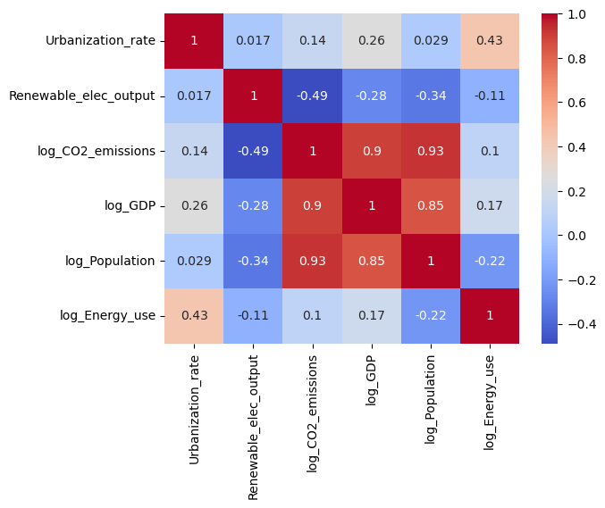

# Q1 Data Acquisition and Preprocessing

## 1. Introduction
The process of acquiring CO2 emissions data and other environmental and socio-economic indicators from the World Bank involved developing several classes and methods to facilitate API calls and subsequent data cleaning and preprocessing.

## 2. Data Acquisition
### 2.1 Data Source
- **Source:** [World Bank Database](https://data.worldbank.org/)
- **Access Method:** World Bank API and manual downloads
- **Date Range:** 1990 - 2020
- **Indicators Downloaded:**
  - CO2 emissions (kt)
  - GDP (current US$)
  - Population, total
  - Energy use (kg of oil equivalent per capita)
  - Urban population (% of total population)
  - Renewable electricity output (% of total electricity output)

### 2.2 Data Download Process
I used the [wbdata](https://wbdata.readthedocs.io/en/stable/) Python library to download data from the World Bank. This allowed me to query and retrieve a DataFrame with data for all available countries in a single call. To focus on the problem and become familiar with the data, I created a smaller DataFrame from the 38 OECD countries for initial analysis.

## 3. Data Preprocessing
### 3.1 Data Cleaning
- Years and countries with more than 50% missing records were removed. For the subset of OECD countries, no such extensive missing data was found. The date range was limited to 1990–2015, as some indicators lacked data beyond 2015.
- Remaining missing values were imputed using interpolation and forward and backward fill techniques, suitable for time series data.

## 4. Data Summary and Key Statistics

### 4.1 Summary of Key Statistics

| Statistic                | CO2 Emissions | GDP              | Population   | Energy Use     | Urbanization Rate | Renewable Elec Output |
|--------------------------|---------------|------------------|--------------|----------------|--------------------|-----------------------|
| **Count**                | 988           | 988              | 988          | 988            | 988                | 988                   |
| **Mean**                 | 326,401.1     | 8.98 × 10¹¹      | 32,155,900   | 3,951.41       | 74.93              | 30.45                 |
| **Standard Deviation**   | 863,364.4     | 2.10 × 10¹²      | 51,944,120   | 2,354.85       | 11.09              | 30.22                 |
| **Minimum**              | 1,859.9       | 4.01 × 10⁹       | 254,826      | 531.13         | 47.92              | 0.00                  |
| **25th Percentile (Q1)** | 36,778.85     | 6.72 × 10¹⁰      | 4,696,449    | 2,510.74       | 67.71              | 6.46                  |
| **Median (Q2)**          | 63,896.75     | 2.38 × 10¹¹      | 10,296,600   | 3,564.76       | 75.94              | 17.48                 |
| **75th Percentile (Q3)** | 337,975.4     | 6.88 × 10¹¹      | 44,224,450   | 4,846.12       | 83.47              | 54.59                 |
| **Maximum**              | 5,775,807     | 1.83 × 10¹³      | 320,739,000  | 18,178.14      | 97.88              | 99.99                 |

### 4.1.1 Observations:
- **CO2 Emissions:** The distribution is highly skewed, with a large gap between the mean (326,401.1) and the maximum (5,775,807). The high standard deviation reflects significant variability.
- **GDP:** GDP ranges from about $4 billion to $18.3 trillion, with a mean of $897.5 billion and a high standard deviation, indicating a wide distribution.
- **Population:** Ranges from 254,826 to over 320 million, with a median of 10.3 million, showing that most countries have smaller populations but a few have very large ones.
- **Energy Use:** Shows a wide range, from a mean of 3,951.41 to a maximum of 18,178.14, with considerable variability.
- **Urbanization Rate:** Relatively consistent, with a mean of 74.93% and a range from 47.92% to 97.88%.
- **Renewable Electricity Output:** Skewed, with a mean of 30.45% and a maximum near 100%. The 25th percentile is low (6.46%), indicating many countries have minimal renewable output.

### 4.1.2 Dealing with Outliers Using Log Transformations:
To address the wide range and skewness in CO2 emissions, GDP, Population, Energy Use, and Renewable Electricity Output, log transformations can normalize the distributions and reduce the impact of outliers.

#### 4.2 Correlation Matrix:

#### 4.2.1 Notable Correlations:
- **Strong Positive Correlations:**
  - **log_CO2_emissions and log_Population (0.928):** Indicates that larger populations are closely linked to higher CO2 emissions.
  - **log_CO2_emissions and log_GDP (0.896):** Reflects that more developed economies tend to have higher CO2 emissions.
  - **log_GDP and log_Population (0.845):** Shows that larger populations generally correspond with higher GDPs.
  - **Urbanization_rate and log_Energy_use (0.432):** Suggests that more urbanized countries tend to use more energy.

- **Strong Negative Correlations:**
  - **Renewable_elec_output and log_CO2_emissions (-0.489):** Highlights that higher renewable electricity output is associated with lower CO2 emissions.
  - **Renewable_elec_output and log_Population (-0.336):** Indicates that more populous countries may have lower renewable electricity output.
  - **Renewable_elec_output and log_GDP (-0.284):** Suggests that higher GDP countries might rely more on non-renewable energy sources.

#### 4.2.2 Interpretation:
The correlation matrix reveals key relationships:
- **Positive Correlations:** Higher CO2 emissions are linked with increased GDP and population. More urbanized areas use more energy.
- **Negative Correlations:** Higher renewable energy output correlates with lower CO2 emissions. More populous and economically developed countries might have lower renewable energy percentages.

These insights underscore the need for promoting renewable energy to balance economic growth with environmental sustainability. Policies aimed at increasing renewable energy could be crucial in reducing CO2 emissions, especially in larger and more developed nations.

### 4.3 Patterns and Anomalies

#### Trend Analysis:
- **CO2 Emissions:** Increased gradually until 2007, then declined, likely due to economic shifts and environmental policies.
- **GDP and Population:** Show consistent growth, with GDP peaking in 2014, reflecting ongoing economic and urban development.
- **Energy Use:** Rose until 2004, then fluctuated, possibly due to shifts towards cleaner energy sources.
- **Renewable Electricity Output:** Notably increased in recent years, peaking in 2015, likely due to global sustainability efforts.

#### Anomalies:
- **2009 Energy Drop:** Sharp decrease in energy use, likely related to the global financial crisis.