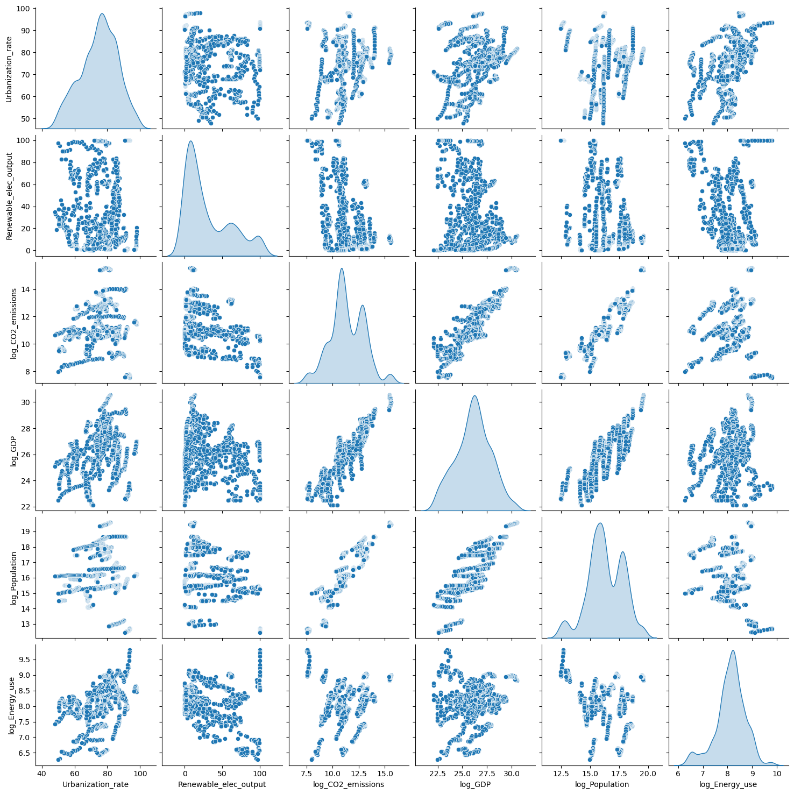

# Q2: Predictive Modeling and Scenario Analysis

## 1. Introduction

In this task, I evaluated several regression models on historical data from OECD countries, which includes features related to socio-economic indicators and CO2 emissions. I performed a series of experiments to assess model performance with and without polynomial feature transformations. Additionally, I conducted a scenario analysis to understand the impact of changes in GDP on CO2 emissions predictions.

The dataset used for this analysis was created in the last section of the [Q1 Jupyter Notebook](../q1.ipynb).

## 2. Model Choice and Experiment Setup

### 2.1. Models Evaluated

I evaluated the following models:
- **Linear Regression**
- **Lasso Regression**
- **Ridge Regression**

### 2.2. Feature Transformations

I explored the effect of second-degree polynomial feature transformations. As shown in the figure below, CO2 emissions do not exhibit a linear relationship with most other indicators (see "cotwo_emi" plots).

### 2.3. Cross-Validation

I used K-Fold cross-validation (with 5 folds) to evaluate model performance and ensure robust results across different subsets of the data.

## 3. Results

### 3.1. Performance Metrics

The performance of each model was assessed using the following metrics:
- **Root Mean Squared Error (RMSE)**: Measures the average magnitude of prediction errors.
- **R² Score**: Indicates the proportion of variance explained by the model.

**Summary of Results:**

| Model              | Poly Degree | Average RMSE    | Average R² |
|--------------------|-------------|-----------------|------------|
| Linear Regression | None         | 268,118.73      | 0.896729   |
| Linear Regression | 2.0          | 48,047.18       | 0.996733   |
| Lasso              | None         | 268,120.64      | 0.896715   |
| Ridge              | None        | 268,894.28      | 0.895847   |
| Lasso              | 2.0          | 49,931.78       | 0.996363   |
| Ridge              | 2.0           | 49,238.62       | 0.996440   |

### 3.2. Interpretation

- **Model Performance**: Models with polynomial features generally showed improved R² scores and reduced RMSE, indicating better fit and prediction accuracy.
- **Comparison of Models**: The three types of models exhibited similar performance when trained with polynomial feature transformations. I selected the Linear Regression model for simplicity, but I acknowledge that Ridge and Lasso models could prevent overfitting.

## 4. Scenario Analysis

### 4.1. Scenario Description

I conducted a scenario analysis to evaluate the impact of a 10% increase in GDP on CO2 emissions predictions. The test set was adjusted by increasing the GDP values by 10%, and predictions were made for this adjusted scenario. The already trained Linear Regression model was used to make these new predictions.

### 4.2. Results of Scenario Analysis

**Percentage Change in CO2 Emissions:**

- **Average Percentage Change**: -0.387%

### 4.3. Interpretation

The scenario analysis showed that a 10% increase in GDP led to an average percentage change of -0.387% in CO2 emissions predictions. This suggests that an increase in GDP in OECD countries might cause a minimal reduction in CO2 emissions. This may be explained by the trends shown in the image below, where CO2 emissions start to decline around 2007 while GDP continues to increase. It is possible that GDP is no longer related to an increase in CO2 emissions, but rather has a minimal effect on it. This relationship might differ if a wider range of countries outside the OECD were considered, so further analysis should be conducted in the future.

