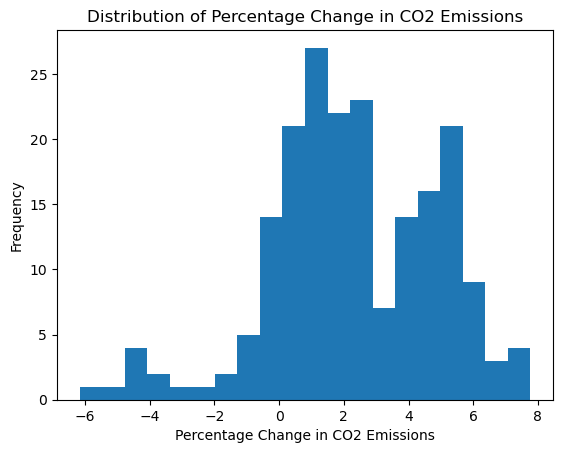

# Q2: Predictive Modeling and Scenario Analysis

## 1. Introduction

In this task, I evaluated several regression models on historical data from OECD countries, which includes features related to socio-economic indicators and CO2 emissions. I performed a series of experiments to assess model performance with and without polynomial feature transformations. Additionally, I conducted a scenario analysis to understand the impact of changes in GDP on CO2 emissions predictions.

The dataset used for this analysis was created in the last section of the [Q1 Jupyter Notebook](../q1.ipynb).

## 2. Model Choice and Experiment Setup

### 2.1. Models Evaluated

I evaluated the following models:
- **Linear Regression**
- **Lasso Regression**
- **Ridge Regression**

### 2.2. Feature Transformations

I explored the effect of second-degree polynomial feature transformations. As shown in the figure below, CO2 emissions do not exhibit a linear relationship with most other indicators.

### 2.3. Cross-Validation

I used K-Fold cross-validation (with 5 folds) to evaluate model performance and ensure robust results across different subsets of the data.

## 3. Results

### 3.1. Performance Metrics

The performance of each model was assessed using the following metrics:
- **Root Mean Squared Error (RMSE)**: Measures the average magnitude of prediction errors.
- **R² Score**: Indicates the proportion of variance explained by the model.

**Summary of Results:**

| Model            | Poly Degree | Scaling | Average RMSE | Average R² |
|------------------|-------------|---------|--------------|------------|
| LinearRegression | NaN         | True    | 0.236811     | 0.977467   |
| LinearRegression | 2.0         | True    | 0.193804     | 0.984789   |
| Lasso            | NaN         | True    | 1.151752     | 0.480489   |
| Ridge            | NaN         | True    | 0.236870     | 0.977468   |
| Lasso            | 2.0         | True    | 1.108727     | 0.518562   |
| Ridge            | 2.0         | True    | 0.209601     | 0.982122   |

### 3.2. Interpretation

- **Model Performance**: The Linear Regression model with polynomial degree 2 achieved the best performance with the lowest RMSE (0.193804) and highest R² (0.984789), indicating a better fit and prediction accuracy compared to other models. 
- **Comparison of Models**: Ridge regression with polynomial degree 2 also performed well, showing competitive results with an RMSE of 0.209601 and an R² of 0.982122. In contrast, Lasso regression, particularly with a polynomial degree of 2, showed higher RMSE and lower R² values, suggesting it was less effective in capturing the relationship between variables.

## 4. Scenario Analysis

### 4.1. Scenario Description

A scenario analysis was conducted to assess the effect of a 10% increase in GDP on CO2 emissions predictions. GDP values in the test set were increased by 10%, and the Linear Regression model was used to predict CO2 emissions under this adjusted scenario.

### 4.2. Results of Scenario Analysis

**Percentage Change in CO2 Emissions:**

- **Average Percentage Change**: 2.3%

### 4.3. Interpretation

The scenario analysis shows that a 10% increase in GDP results in an average 2.3% increase in CO2 emissions. This indicates a moderate sensitivity of CO2 emissions to changes in GDP, reflecting a direct relationship between economic activity and environmental impact. The relatively modest increase suggests that while economic growth does contribute to higher emissions, the effect is not disproportionately large compared to the increase in GDP.