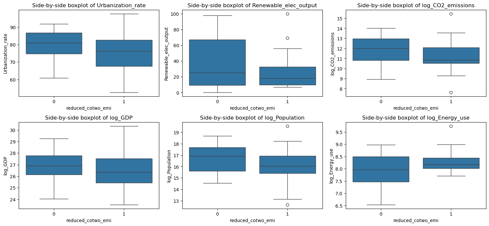

# Q4: Classification and Policy Implications

## 1. Introduction

In this task, I created a labeled dataset for a binary classification problem. I calculated the percentage change in CO2 emissions from 2005 to 2015 for each country. Countries with a reduction of CO2 emissions greater than 10% were labeled as successful. This dataset was used to train a classification model to predict whether a country will achieve significant CO2 emissions reduction.

## 2. Labeled Dataset

Two versions of the dataset were created: one with all historic data labeled and another grouped by country with medians calculated for numeric features over the 10-year span. The grouped dataset, with 38 records, performed poorly, suggesting the need for a larger sample size. The historic data dataset performed better, but its suitability for this problem remains uncertain.

## 3. Classifier Performance

The following cross-validation accuracies were obtained for different models:

- **Logistic Regression**: 0.7899 ± 0.0194
- **K-Nearest Neighbors**: 0.9924 ± 0.0047
- **Support Vector Machine**: 0.8848 ± 0.0417

## 4. Key Features Driving the Classification

Feature importance analysis identified the following key driver of successful CO2 emission reduction:

- **Renewable Electricity Output (ren_elec_out)**: This feature was the most important factor in the model. However, analysis suggests that countries unable to reduce CO2 emissions by 10% tend to have higher renewable electricity output values. This may indicate either a data issue or that increasing renewable electricity alone is insufficient for significant CO2 reduction.

